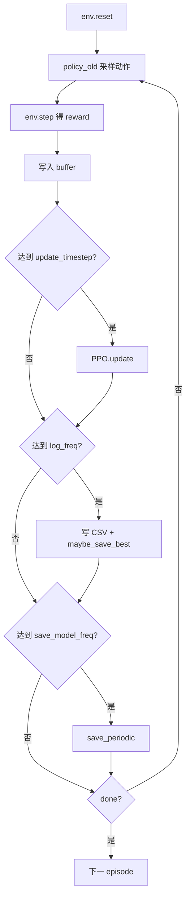

# 深度强化学习：PPO 与 LunarLander-v2 项目说明

本文档说明 **Proximal Policy Optimization (PPO)** 的核心思想，以及本仓库 `lunar_lander_v2_PPO` 子项目中训练、测试、评估、绘图与 GIF 生成的流程与目录结构。

---

## 1. PPO 算法简介

PPO（近端策略优化）是一种 **on-policy** 的策略梯度算法，在 TRPO 思想基础上用 **裁剪目标函数** 限制每次策略更新幅度，使训练更稳定。

### 1.1 核心组件

| 组件 | 作用 |
|------|------|
| **Actor** | 输出动作分布（离散：Softmax + 分类采样；连续：高斯均值 + 固定方差） |
| **Critic** | 估计状态价值 \(V(s)\) |
| **Rollout buffer** | 暂存 \((s, a, \log\pi_{\text{old}}, V, r, done)\) |
| **policy_old** | 行为策略，用于采样与环境交互 |
| **policy** | 学习策略，用 PPO 损失更新后同步到 `policy_old` |

### 1.2 目标函数（裁剪版）

记重要性采样比 \(r_t(\theta) = \frac{\pi_\theta(a_t|s_t)}{\pi_{\theta_{\text{old}}}(a_t|s_t)}\)，优势函数 \(A_t\)（本实现用蒙特卡洛回报减 \(V\)）：

\[
L^{\text{CLIP}}(\theta) = \mathbb{E}_t\left[\min\left(r_t(\theta) A_t,\ \text{clip}(r_t(\theta), 1-\epsilon, 1+\epsilon)\, A_t\right)\right]
\]

总损失（与代码一致）：

\[
\text{loss} = -L^{\text{CLIP}} + 0.5 \cdot \text{MSE}(V, R) - 0.01 \cdot H(\pi)
\]

其中 \(\epsilon=0.2\)，\(H\) 为策略熵（鼓励探索）。

### 1.3 本实现的简化点

- 使用 **蒙特卡洛回报** 估计优势，未使用 GAE。
- 连续动作的标准差 `action_std` 为超参并可线性衰减（LunarLander 为离散动作，不涉及）。
- 单线程采集，无并行 worker。

---

## 2. 项目代码结构（重构后）

```
lunar_lander_v2_PPO/
├── rl/                      # 纯 RL 算法（无 LLM 隐喻）
│   ├── device.py            # CPU/CUDA 设备
│   └── ppo.py               # RolloutBuffer, ActorCritic, PPO
├── llm_integration/         # Software-as-LLM 概念层（文档/隐喻）
│   └── dual_policy.py       # policy / policy_old 与 lead/subagent 说明
├── training/                # 训练编排
│   ├── config.py            # TrainConfig 超参数
│   ├── checkpoints.py       # 周期保存 + 最佳模型 + 元数据日志
│   └── runner.py            # 训练主循环
├── train.py                 # 训练入口
├── test.py                  # 加载模型并渲染测试
├── plot_graph.py            # 从 CSV 日志画学习曲线
├── make_gif.py              # 保存帧并合成 GIF
└── PPO.py                   # 向后兼容：重导出 rl.ppo
```

**关注点分离：**

- `rl/`：网络结构、采样、`update()`、保存/加载权重。
- `training/`：环境循环、日志 CSV、检查点策略。
- `llm_integration/`：双策略与「主/子智能体」叙事，便于与 software-as-LLM 主题对齐，不参与梯度计算。

---

## 3. 训练（`train.py`）

### 3.1 运行

```bash
cd lunar_lander_v2_PPO
python train.py
```

### 3.2 LunarLander-v2 默认超参数（`TrainConfig`）

| 参数 | 默认值 | 说明 |
|------|--------|------|
| `max_training_timesteps` | 1e6 | 总环境步数上限 |
| `max_ep_len` | 300 | 单局最大步数 |
| `update_timestep` | 1200 | 每 N 步调用一次 `ppo_agent.update()` |
| `K_epochs` | 80 | 每次 update 内优化轮数 |
| `eps_clip` | 0.2 | PPO 裁剪系数 |
| `gamma` | 0.99 | 折扣因子 |
| `lr_actor` / `lr_critic` | 3e-4 / 1e-3 | Actor / Critic 学习率 |
| `log_freq` | 600 | 写 CSV 与评估「区间平均回报」 |
| `save_model_freq` | 50000 | 周期性保存 |

### 3.3 日志与检查点

**CSV 日志**（`PPO_logs/LunarLander-v2/PPO_LunarLander-v2_log_<run>.csv`）  
列：`episode,timestep,reward`，其中 `reward` 为最近 `log_freq` 步内各 episode 回报的**平均值**。

**周期性权重**  
`PPO_preTrained/LunarLander-v2/PPO_LunarLander-v2_<seed>_<run>.pth`

**最佳模型（自动）**  
当 `log_freq` 区间的平均回报**创新高**时写入：

| 文件 | 内容 |
|------|------|
| `PPO_preTrained/LunarLander-v2/best/PPO_LunarLander-v2_best.pth` | 当前最优 `policy_old` 权重 |
| `.../best/best_metadata.json` | 最新一次最佳：步数、episode、回报、完整超参 |
| `.../best/best_checkpoint_log.jsonl` | 每次刷新最佳时追加一行 JSON |
| `PPO_preTrained/LunarLander-v2/run_<n>_hyperparameters.json` | 本次训练 run 的完整超参快照 |

---

## 4. 测试（`test.py`）

```bash
python test.py
```

- 默认加载 **best** 检查点；若不存在则回退到周期性 `PPO_LunarLander-v2_42_0.pth`。
- 运行 10 个 episode，可选 `env.render()` 可视化。
- 打印每局回报与平均测试回报。

可调：`use_best_checkpoint`、`random_seed`、`run_num_pretrained`。

---

## 5. 评估与学习曲线（`plot_graph.py`）

```bash
python plot_graph.py
```

- 读取 `PPO_logs/LunarLander-v2/` 下所有 `*_log_*.csv`。
- 默认对多次 run **按 timestep 索引取平均**，并做三角窗平滑。
- 输出图：`PPO_figs/LunarLander-v2/PPO_LunarLander-v2_fig_0.png`。

用于**离线评估训练趋势**，不加载神经网络。

---

## 6. GIF 生成（`make_gif.py`）

```bash
python make_gif.py
```

两阶段：

1. **`save_gif_images`**：用训练好的策略跑 1 局，将 `env.render(mode='rgb_array')` 存为  
   `PPO_gif_images/LunarLander-v2/000001.jpg` …
2. **`save_gif`**：按 `step` 抽帧、`frame_duration` 控制帧间隔，合成  
   `PPO_gifs/LunarLander-v2/PPO_LunarLander-v2_gif_0.gif`

同样优先加载 **best** 检查点。`list_gif_size` 可列出 GIF 体积。

---

## 7. 训练流程示意



---

## 8. 依赖与环境

- Python 3.x，PyTorch，OpenAI Gym（`LunarLander-v2` 需 `box2d`）。
- `test.py` / `make_gif.py` 已移除对 `roboschool` 的硬依赖（仅 LunarLander 时不需要）。

---

## 9. 与 Software-as-LLM 的关系

PPO 中的 **双网络**（`policy_old` 采集、`policy` 学习）在 `llm_integration/dual_policy.py` 中对应「子智能体 / 主智能体」叙事，便于与「软件即 LLM」主题对照；算法实现仍完全在 `rl/ppo.py` 中，便于单独阅读或替换为其他 RL 方法。

---

*文档路径：`d:\code\software_as_llm\Deep_RL_PPO.md`*
